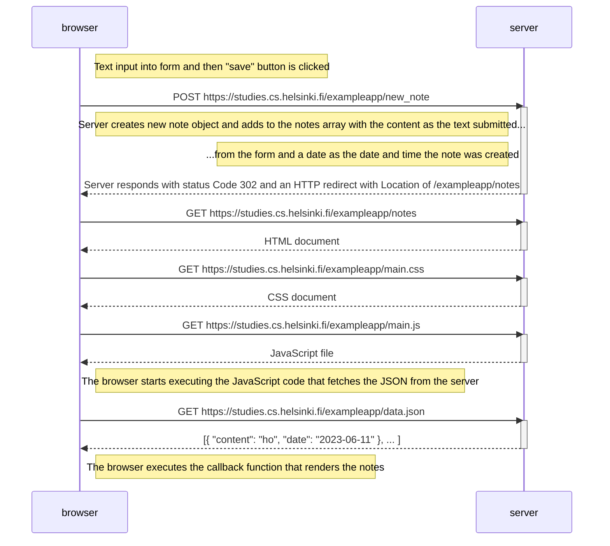

```mermaid
sequenceDiagram
    participant browser
    participant server
    
    Note right of browser: Text input into form and then "save" button is clicked
    browser->>server: POST https://studies.cs.helsinki.fi/exampleapp/new_note
    activate server
    Note left of server: Server creates new note object and adds to the notes array with the content as the text submitted...
    Note left of server: ...from the form and a date as the date and time the note was created
    server-->>browser: Server responds with status Code 302 and an HTTP redirect with Location of /exampleapp/notes
    deactivate server
    
    browser->>server: GET https://studies.cs.helsinki.fi/exampleapp/notes
    activate server
    server-->>browser: HTML document
    deactivate server
    
    browser->>server: GET https://studies.cs.helsinki.fi/exampleapp/main.css
    activate server
    server-->>browser: CSS document
    deactivate server
    
    browser->>server: GET https://studies.cs.helsinki.fi/exampleapp/main.js
    activate server
    server-->>browser: JavaScript file
    deactivate server
    
    Note right of browser: The browser starts executing the JavaScript code that fetches the JSON from the server
    browser->>server: GET https://studies.cs.helsinki.fi/exampleapp/data.json
    activate server
    server-->>browser: [{ "content": "ho", "date": "2023-06-11" }, ... ]
    deactivate server
    
    Note right of browser: The browser executes the callback function that renders the notes
```
